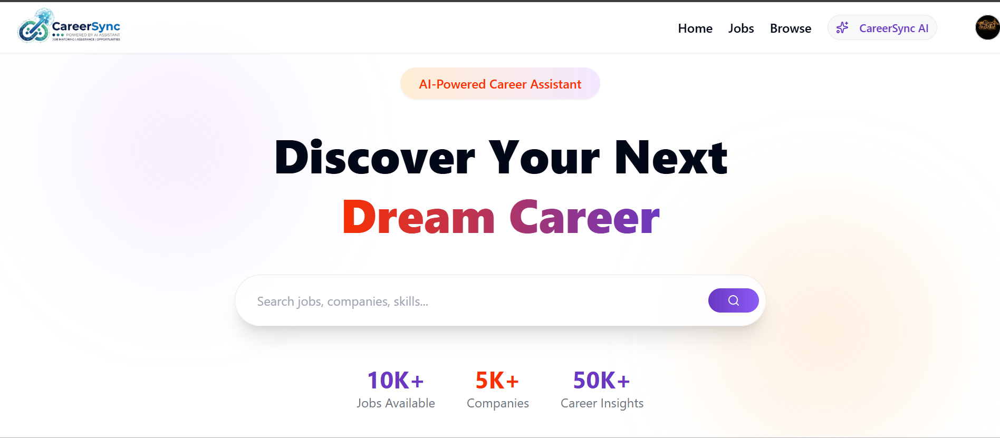

# CareerSync – AI-Powered Job Portal with Resume-Aware RAG Assistant

CareerSync is a full-stack AI-powered hiring platform built using the MERN stack. It enables job seekers to discover relevant opportunities while helping recruiters efficiently manage job postings and applicants.

To make the hiring experience more intelligent, CareerSync integrates **Google Gemini**, **LangChain**, **Retrieval-Augmented Generation (RAG)**, and **Qdrant Vector Database**. The platform analyzes uploaded resumes, predicts suitable job roles, recommends matching jobs, and provides personalized career guidance through a resume-aware AI assistant.

Unlike traditional AI chatbots, the assistant answers questions using the candidate's uploaded resume as contextual knowledge, producing accurate and personalized responses.

---

## Preview


---

# Features

## Job Seekers

- Secure Registration & Login (JWT Authentication)
- Browse and Search Jobs
- Filter Jobs by Role, Location, and Keywords
- Apply for Jobs
- Upload Resume
- View Applied Jobs
- Personalized Dashboard

## Recruiters

- Recruiter Authentication
- Company Management
- Create, Update, and Delete Job Listings
- View Applicants
- Manage Posted Jobs

---

# AI Features

## AI Resume Analysis

- Extracts text from uploaded PDF resumes
- Identifies technical skills and projects
- Detects candidate experience
- Predicts the most suitable job role

---

## Smart Job Recommendation

- Uses AI-predicted job role
- Searches matching jobs from the database
- Returns personalized job recommendations
- Suggests relevant companies

---

## Resume-Aware RAG Career Assistant

CareerSync includes a Retrieval-Augmented Generation (RAG) based AI assistant.

Instead of relying only on the language model, the assistant retrieves relevant information from the user's uploaded resume stored as vector embeddings in Qdrant before generating a response.

The assistant can answer questions like:

- Review my resume
- What are my strengths?
- Which projects should I highlight?
- Which skills should I improve?
- Which technology should I learn next?
- Why am I suitable for this role?
- Suggest career improvements

Responses are generated using:

- Resume embeddings
- Retrieved resume context
- Google Gemini 2.5 Flash
- LangChain Retrieval Chain

---

## Resume Embedding Pipeline

The uploaded resume goes through the following AI pipeline:

```
PDF Resume
      │
      ▼
Text Extraction
      │
      ▼
Text Chunking
      │
      ▼
Gemini Embeddings
      │
      ▼
Qdrant Vector Database
      │
      ▼
Semantic Retrieval
      │
      ▼
Google Gemini
      │
      ▼
Personalized AI Response
```

---

# Tech Stack

## Frontend

- React.js
- Redux Toolkit
- Tailwind CSS
- React Router
- Axios

---

## Backend

- Node.js
- Express.js
- MongoDB
- Mongoose
- JWT Authentication
- Multer
- Cloudinary

---

## AI Stack

- Google Gemini 2.5 Flash
- Google Gemini Embeddings
- LangChain
- Qdrant Vector Database
- FastAPI
- Retrieval-Augmented Generation (RAG)

---

# System Architecture

```
React Frontend
       │
       ▼
Node.js Backend
       │
       ├────────────► MongoDB
       │
       ├────────────► Cloudinary
       │
       ▼
FastAPI AI Service
       │
       ▼
Resume Processing
       │
       ▼
Gemini Embeddings
       │
       ▼
Qdrant Vector Store
       │
       ▼
Retriever
       │
       ▼
Gemini 2.5 Flash
       │
       ▼
AI Response
```

---

# What I Learned

- Full-Stack MERN Development
- JWT Authentication & Authorization
- Role-Based Access Control
- REST API Design
- MongoDB Data Modeling
- Resume Parsing
- Prompt Engineering
- LangChain Fundamentals
- Google Gemini Integration
- Embedding Models
- Vector Databases
- Semantic Search
- Retrieval-Augmented Generation (RAG)
- Qdrant Integration
- FastAPI Microservices
- Production-Style AI System Design

---

# Future Improvements

- Multi-Resume Support
- Chat History
- Resume Versioning
- AI Mock Interview
- Resume Score & ATS Analysis
- Semantic Job Search
- Email Notifications
- Recruiter AI Candidate Matching

---

# Author

## Sumit Kumawat

Final Year B.Tech Student | MERN Stack Developer | Generative AI Enthusiast

Passionate about building scalable full-stack applications, AI-powered systems, and Retrieval-Augmented Generation (RAG) solutions that solve real-world hiring problems.